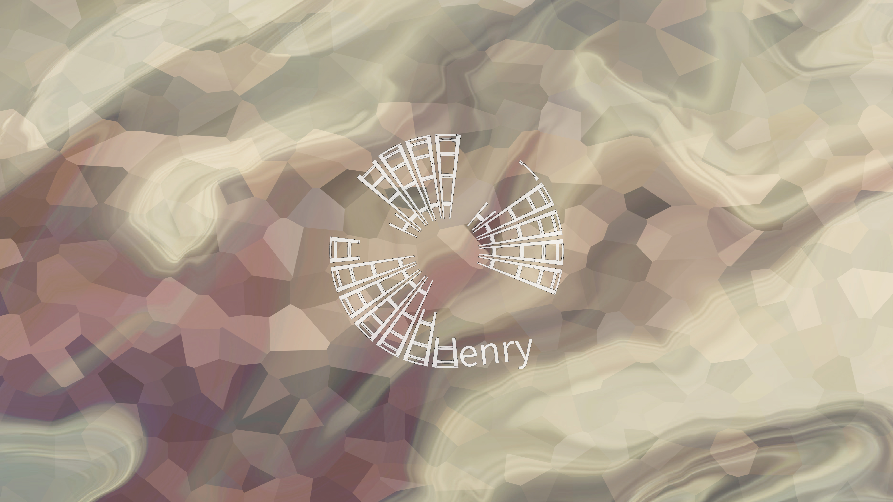

# Hello, I'm Henry :coffee:

> #### Spend a little more time trying to make something of yourself and a little less time trying to impress people.
 


---


### Spotify Playing 🎧

[](https://open.spotify.com/user/31uznrpamxhroyd2bt7xchxgnhce)

---


[](https://github.com/anuraghazra/github-readme-stats)

<!--START_SECTION:waka-->


**🐱 My GitHub Data** 

> 📦 452.7 kB Used in GitHub's Storage 
 > 
> 🏆 82 Contributions in the Year 2025
 > 
> 🚫 Not Opted to Hire
 > 
> 📜 17 Public Repositories 
 > 
> 🔑 8 Private Repositories 
 > 
**I'm an Early 🐤** 

```text
🌞 Morning                217 commits         ████░░░░░░░░░░░░░░░░░░░░░   17.40 % 
🌆 Daytime                578 commits         ████████████░░░░░░░░░░░░░   46.35 % 
🌃 Evening                402 commits         ████████░░░░░░░░░░░░░░░░░   32.24 % 
🌙 Night                  50 commits          █░░░░░░░░░░░░░░░░░░░░░░░░   04.01 % 
```
📅 **I'm Most Productive on Wednesday** 

```text
Monday                   178 commits         ████░░░░░░░░░░░░░░░░░░░░░   14.27 % 
Tuesday                  215 commits         ████░░░░░░░░░░░░░░░░░░░░░   17.24 % 
Wednesday                253 commits         █████░░░░░░░░░░░░░░░░░░░░   20.29 % 
Thursday                 188 commits         ████░░░░░░░░░░░░░░░░░░░░░   15.08 % 
Friday                   191 commits         ████░░░░░░░░░░░░░░░░░░░░░   15.32 % 
Saturday                 151 commits         ███░░░░░░░░░░░░░░░░░░░░░░   12.11 % 
Sunday                   71 commits          █░░░░░░░░░░░░░░░░░░░░░░░░   05.69 % 
```


📊 **This Week I Spent My Time On** 

```text
🕑︎ Time Zone: Asia/Taipei

💬 Programming Languages: 
JavaScript               38 hrs 17 mins      ██████████████████░░░░░░░   72.68 % 
Blender                  9 hrs 9 mins        ████░░░░░░░░░░░░░░░░░░░░░   17.38 % 
Markdown                 2 hrs 14 mins       █░░░░░░░░░░░░░░░░░░░░░░░░   04.26 % 
TypeScript               1 hr 2 mins         ░░░░░░░░░░░░░░░░░░░░░░░░░   01.98 % 
JSON                     57 mins             ░░░░░░░░░░░░░░░░░░░░░░░░░   01.81 % 

🔥 Editors: 
Cursor                   43 hrs 31 mins      █████████████████████░░░░   82.62 % 
Blender                  9 hrs 9 mins        ████░░░░░░░░░░░░░░░░░░░░░   17.38 % 

🐱‍💻 Projects: 
teamsync-frontend        41 hrs 20 mins      ████████████████████░░░░░   78.50 % 
fruit-shop               8 hrs 59 mins       ████░░░░░░░░░░░░░░░░░░░░░   17.07 % 
itac-lab                 1 hr 32 mins        █░░░░░░░░░░░░░░░░░░░░░░░░   02.92 % 
mssql                    33 mins             ░░░░░░░░░░░░░░░░░░░░░░░░░   01.05 % 
tree                     6 mins              ░░░░░░░░░░░░░░░░░░░░░░░░░   00.22 % 

💻 Operating System: 
Windows                  52 hrs 40 mins      █████████████████████████   100.00 % 
```

**I Mostly Code in JavaScript** 

```text
JavaScript               12 repos            ██████████░░░░░░░░░░░░░░░   38.71 % 
C#                       8 repos             ██████░░░░░░░░░░░░░░░░░░░   25.81 % 
HTML                     5 repos             ████░░░░░░░░░░░░░░░░░░░░░   16.13 % 
TypeScript               4 repos             ███░░░░░░░░░░░░░░░░░░░░░░   12.90 % 
Visual Basic .NET        1 repo              █░░░░░░░░░░░░░░░░░░░░░░░░   03.23 % 
```


**Timeline**


 Last Updated on 2025-09-17 18:26:18 UTC
<!--END_SECTION:waka-->

---

### Project Link ↗️

- #### [Portfolio](https://drive.google.com/file/d/1kb96bzn4Bhdb4pImsUvKz9Oi9cx455D2/view?usp=drivesdk)
- #### [Sketchfab](https://sketchfab.com/henry4294967296/models)

