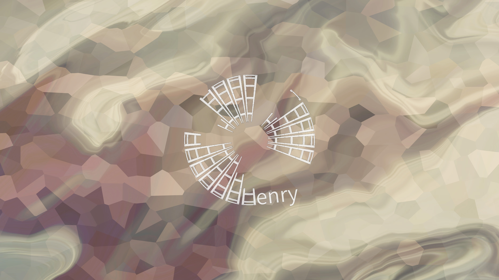

# Hello, I'm Henry :coffee:

> #### Spend a little more time trying to make something of yourself and a little less time trying to impress people.
 


---


### Spotify Playing 🎧

[](https://open.spotify.com/user/31uznrpamxhroyd2bt7xchxgnhce)

---


[](https://github.com/Pranesh-2005/github-readme-stats-fast)

<!--START_SECTION:waka-->


**🐱 My GitHub Data** 

> 📦 467.1 kB Used in GitHub's Storage 
 > 
> 🏆 529 Contributions in the Year 2026
 > 
> 🚫 Not Opted to Hire
 > 
> 📜 24 Public Repositories 
 > 
> 🔑 10 Private Repositories 
 > 
**I'm an Early 🐤** 

```text
🌞 Morning                662 commits         ████░░░░░░░░░░░░░░░░░░░░░   15.37 % 
🌆 Daytime                2179 commits        █████████████░░░░░░░░░░░░   50.60 % 
🌃 Evening                1251 commits        ███████░░░░░░░░░░░░░░░░░░   29.05 % 
🌙 Night                  214 commits         █░░░░░░░░░░░░░░░░░░░░░░░░   04.97 % 
```
📅 **I'm Most Productive on Wednesday** 

```text
Monday                   720 commits         ████░░░░░░░░░░░░░░░░░░░░░   16.72 % 
Tuesday                  723 commits         ████░░░░░░░░░░░░░░░░░░░░░   16.79 % 
Wednesday                834 commits         █████░░░░░░░░░░░░░░░░░░░░   19.37 % 
Thursday                 644 commits         ████░░░░░░░░░░░░░░░░░░░░░   14.96 % 
Friday                   609 commits         ████░░░░░░░░░░░░░░░░░░░░░   14.14 % 
Saturday                 424 commits         ██░░░░░░░░░░░░░░░░░░░░░░░   09.85 % 
Sunday                   352 commits         ██░░░░░░░░░░░░░░░░░░░░░░░   08.17 % 
```


📊 **This Week I Spent My Time On** 

```text
🕑︎ Time Zone: Asia/Taipei

💬 Programming Languages: 
No Activity Tracked This Week

🔥 Editors: 
No Activity Tracked This Week

🐱‍💻 Projects: 
No Activity Tracked This Week

💻 Operating System: 
No Activity Tracked This Week
```

**I Mostly Code in JavaScript** 

```text
JavaScript               13 repos            ███████░░░░░░░░░░░░░░░░░░   26.53 % 
Python                   9 repos             █████░░░░░░░░░░░░░░░░░░░░   18.37 % 
TypeScript               9 repos             █████░░░░░░░░░░░░░░░░░░░░   18.37 % 
Shell                    3 repos             ██░░░░░░░░░░░░░░░░░░░░░░░   06.12 % 
Lua                      1 repo              █░░░░░░░░░░░░░░░░░░░░░░░░   02.04 % 
```


**Timeline**


 Last Updated on 2026-10-01 02:00:58 UTC
<!--END_SECTION:waka-->

---

### Link ↗️

- #### [Project](https://drive.google.com/drive/folders/1APQlkPhpVlf63qN5CJRx-D9h8z-6oT8D?usp=sharing)
- #### [HackMD](https://hackmd.io/@henry5720)
- #### [Sketchfab](https://sketchfab.com/henry4294967296/models)
- #### [dotfile](https://github.com/henry5720/dotfiles)

https://github.com/user-attachments/assets/337b5025-1d23-4c9a-86c6-cfba083f6888

### Counter
](https://count.getloli.com/@henry5720?name=henry5720&theme=random&padding=7&offset=0&align=top&scale=1&pixelated=1&darkmode=1)
